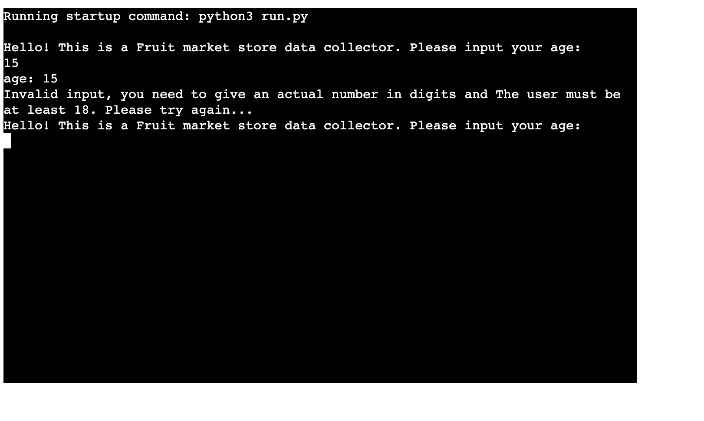
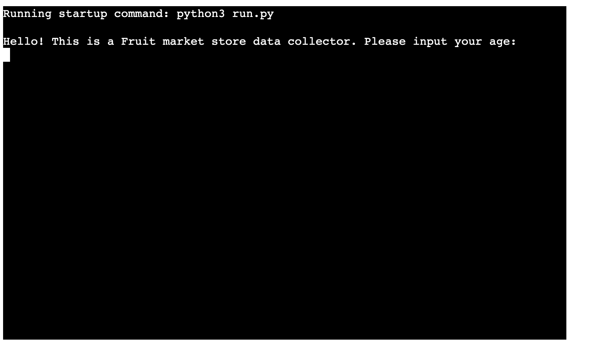
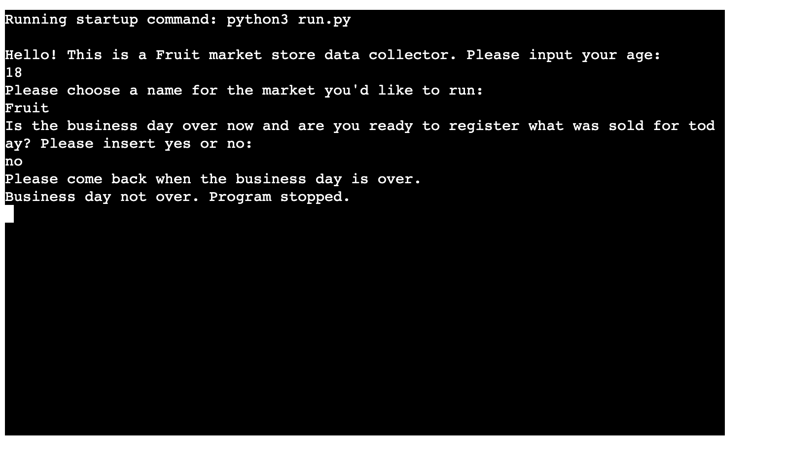
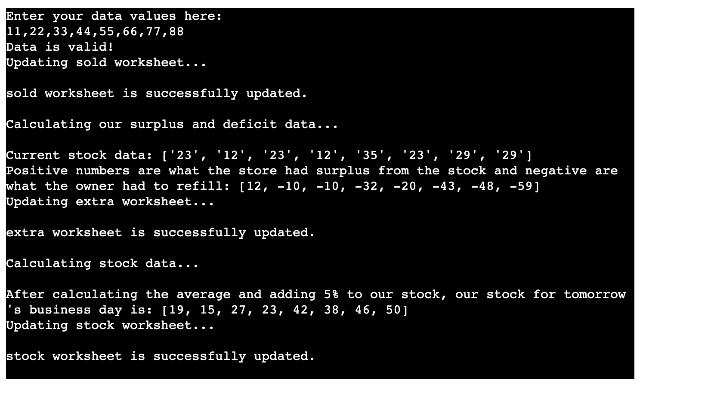
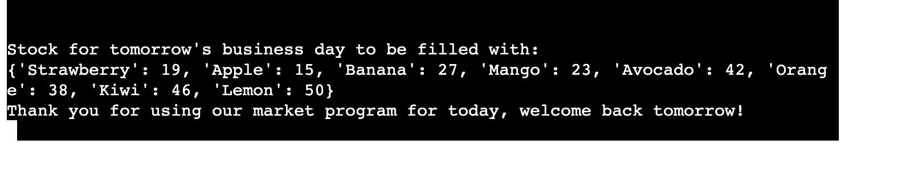

# Fruits Market
Fruit Market Sales Data Collector application; The purpose of this Python application is to help manage and analyze sales data for a fruit market store. The code allows the user (the store owner or manager) to input the number of products sold for different types of fruits on a given business day.

Here is the live version of the project.

## How to use:
- Open your terminal, the program will start by asking for your age and the name of your fruit market store. Enter the required information.

- Enter Sales Data: If the business day is over and you are ready to register the products sold, the program will prompt you to input the number of products sold for each fruit type. Provide the quantities separated by commas.

- Validation and Data Update: The program will validate your input and update the sales data in the Google Sheets document.

- Surplus/Deficit Calculation: The program will calculate the surplus or deficit for each fruit based on the current stock and the sales data. It will display the results.

- Stock Calculation: The program will calculate the stock for each fruit type for the next business day, considering the average sales of the last three days and adding 5% to each value. It will display the stock data in a dictionary format.

- Thank You: The program will thank you for using it, and you can close the terminal.

## Features:
- User-friendly:

The program starts by asking for your age and the name of your fruit market store. It ensures that the user is at least 18 years old to proceed.

The program stops if the user is less than 18

The program continues to ask the user to pick a name for their market

- Data Status:
The program will ask the user if the business day is over to start inserting the data or not by sending a yes or no:

In case it isnt done:

It will stop the program from running.

In case it is done, it leads us to the next feature:

- 6-steps outcomes feature:

1. Data Collection:
After the initial setup, the program prompts you to input the number of products sold for each fruit type (e.g., Strawberry, Apple, Banana, Mango, Avocado, Orange, Kiwi, Lemon) on the current business day.

2. Data Validation: The program validates the input data, ensuring that you provide exactly eight values, and each value is a whole number. It asks you to re-enter the data if there are any issues.

3. Data Update: Once the data is validated, the program updates the sales data in the Google Sheets document, making it easy to keep track of the daily sales.

4. Surplus/Deficit Calculation: The program calculates the surplus or deficit for each fruit based on the current stock and the sales data. It shows the additional fruits remaining in the stock or the number of fruits that need to be replenished from the orchard.

5. Stock Calculation: The program calculates the stock for each fruit type for the next business day. It uses the average sales of the last three days and adds 5% to each value to ensure sufficient stock availability.

- User experience: 

Thank You: The program will thank you for using it, and you can close the terminal.

